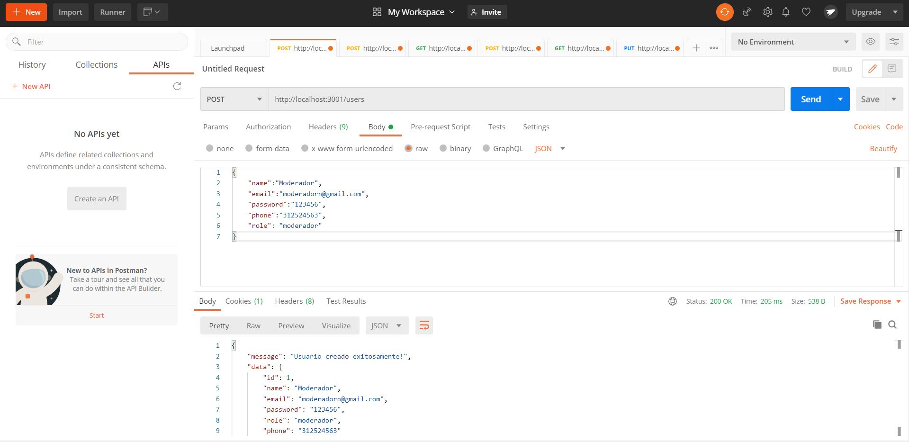

<h1>TELEPERFORMANCE</h1>

    </img>

<h1>Como Correr el proyecto</h1>
<ul>
<li>Crea una base de de datos en Postgresql llamada kuepadb</li>
<li>Crea un archivo dentro de la carpeta "api" llamado env.js con el siguiente contenido:
<pre>
<code>
const DB_USER='tuusuariodeposgresql'
const DB_PASSWORD='tucontraseñadepostgresql'
const DB_HOST='localhost:tupuertodepostgres'
module.exports = {
    DB_USER,
    DB_PASSWORD,
    DB_HOST
}
</code>
</pre>
</li>
<li>Posicionate en api y ejecuta npm install</li>
<li>Posicionate en client y ejecuta npm install</li>
<li>En una terminal  Posicionate en client y ejecuta npm start</li>
<li>En una terminal  Posicionate en api y ejecuta npm start</li>
</ul>

<h2>USUARIO MODERADOR</h2>

    Para crear un usuario moderador, debes abrir tu postman y crear este usuario de la siguiente forma:. .

<h4>DATOS PARA CREAR MODERADOR</h4>

<ul>
    <li>RUTA: http://localhost:3001/users</li>
    <li>Objeto ejemplo moderador
    <pre>
    <code>
{
    "name":"Moderador",
    "email":"moderadorn@gmail.com",
    "password":"123456",
    "phone":"312524563",
    "role": "moderador"
}
    </code>
    </pre>
    </li>
</ul>

    </img>

    Cuando crees el moderador, tienes que loguearte con las credenciales del mismo. Una vez estes logueado como moderador, ya puedes loguear estudiantes para difrutar la clase.

<h1>RESUMEN</h1>

    Estas fueron todas las configuraciones que debes hacer para correr el proyecto. Ahora Vas a poder registrar usuarios y loguearte para disfrutar de la clase.

    Para probar el chat, debes abrir varias pestañas y logguearte con usuarios diferentes. Luego puedes empezar a interactuar con los estudiantes y moderador presentes en la sala.

    <h1> TECNOLOGIAS USADAS </h1>
        <h2>FRONTEND</h2>
        <ul>
            <li>React hooks</li>
            <li>Redux</li>
            <li>react Bootstrap</li>
            <li>socket.io-client</li>
        </ul>
        <h2>BACKEND</h2>
        <ul>
            <li>Nodejs</li>
            <li>Express JS</li>
            <li>Sequelize (PostgreSQL)</li>
            <li>Passport</li>
            <li>socket.io</li>
        </ul>

